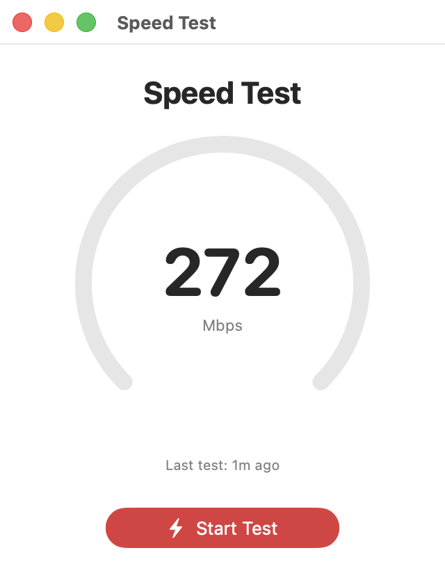
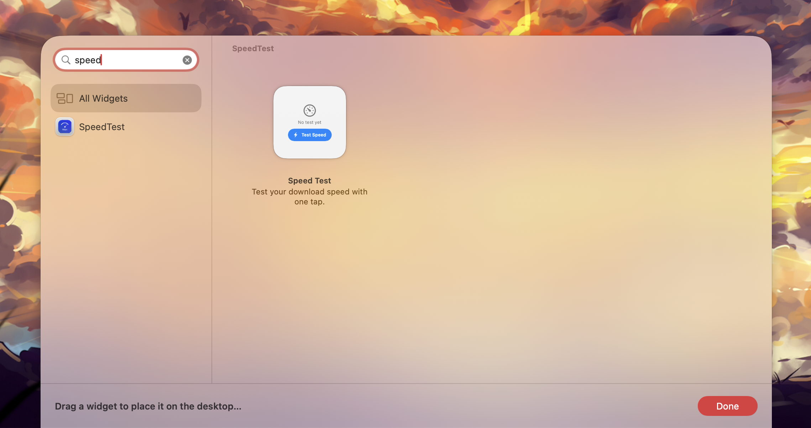

# Speed Test

A native macOS app and widget that measures your download speed with a single tap. Like fast.com, but built into your desktop.



## Features

- **Desktop Widget** — Test speed right from Notification Center or your desktop, no app launch needed
- **Menu Bar Extra** — Quick access from the menu bar with one-click testing
- **Cloudflare CDN** — Downloads from Cloudflare's global edge network for accurate, consistent results
- **Adaptive Algorithm** — Progressive chunk sizes (100KB to 25MB) with weighted averaging
- **Private** — No tracking, no accounts, no ads. Data stays on your device
- **Native** — Pure Swift with zero dependencies. Built with SwiftUI and WidgetKit

## Install

### Download

Grab the latest `.dmg` from [Releases](https://github.com/hsavit1/SpeedTest/releases/latest), open it, and drag **Speed Test** to your Applications folder.

### Or via Terminal

```bash
curl -sL https://raw.githubusercontent.com/hsavit1/SpeedTest/main/install.sh | bash
```

### Add the Widget

1. Click the date/time in your menu bar
2. Scroll down and click **Edit Widgets**
3. Search for "SpeedTest" and drag it to your desktop



## How It Works

The speed test downloads progressively larger files from `speed.cloudflare.com`:

1. **Warm-up** — 50KB download to establish TCP + TLS (discarded)
2. **Progressive chunks** — 100KB, 1MB, 5MB, 10MB, 25MB downloads
3. **Adaptive** — Skips large chunks on slow connections; stops after 15s
4. **Weighted average** — Larger samples carry more weight for accuracy

## Requirements

- macOS 14 Sonoma or later
- Apple Silicon or Intel Mac

## Building from Source

```bash
brew install xcodegen
cd SpeedTest
xcodegen generate
xcodebuild -project SpeedTest.xcodeproj -scheme SpeedTest -configuration Release build
```

## License

No Zionist License

Free Palestine 🇵🇸
